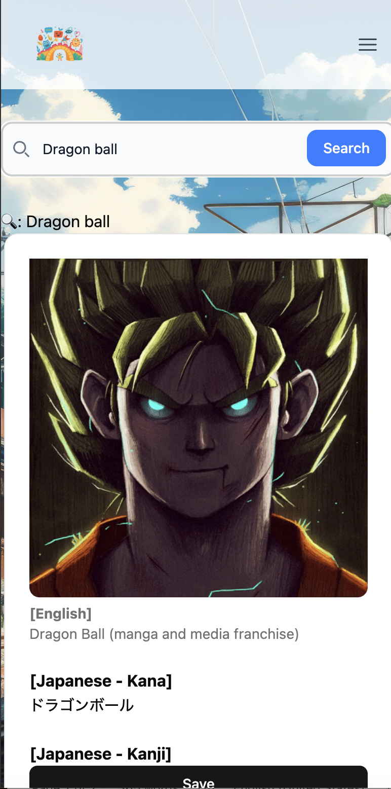

# LinguaBridge – A Fun Japanese Learning App (Featuring Dragon Ball)

## Introduction
Mobile friendly Full Stack (MERN) app designed for younger children to learn Japanese language in a fun way collecting characters in DragonBall series!

I built this app for my 6-year-old son, who loves memorizing Dragon Ball characters. It’s my first full-stack MERN project, combining fun learning with a bit of family motivation

Click Goku to start learning:  

 

## Screenshots 

### Signup/ Login

### Questions (Daily Quiz/ Quest)

### Badge 

### Search and Save

## Tech Stack & Tools
* **Frontend: React.js (TypeScript),  TailwindCSS + shadcn/ui** 
* **Backend: Node.js, Express.js** 
* **Authentication: JWT** 
* **DataBase: MongoDB/ Mongoose** 
* **Image Storage: Cloudinary** 
* **Server: AWS EC2** 
* **Mockup: Miro**

**Other Resources:** 
* **Dragon Ball API**
* **Adobe Stock**
* **Canva**
* **w3schools**
* **mdn**
* **stackoverflow**
* **AI Assistance** - Used Generative AI (ChatGPT) to  help me with Typescript, Create Context

## Future Enhancements
* AI Assistants workflow for content generation 
* Add Friends
Leader Board
* Define level/badge clearly
* Add more Question library
* Implement Touch Event Listeners for Mobile Device Support

